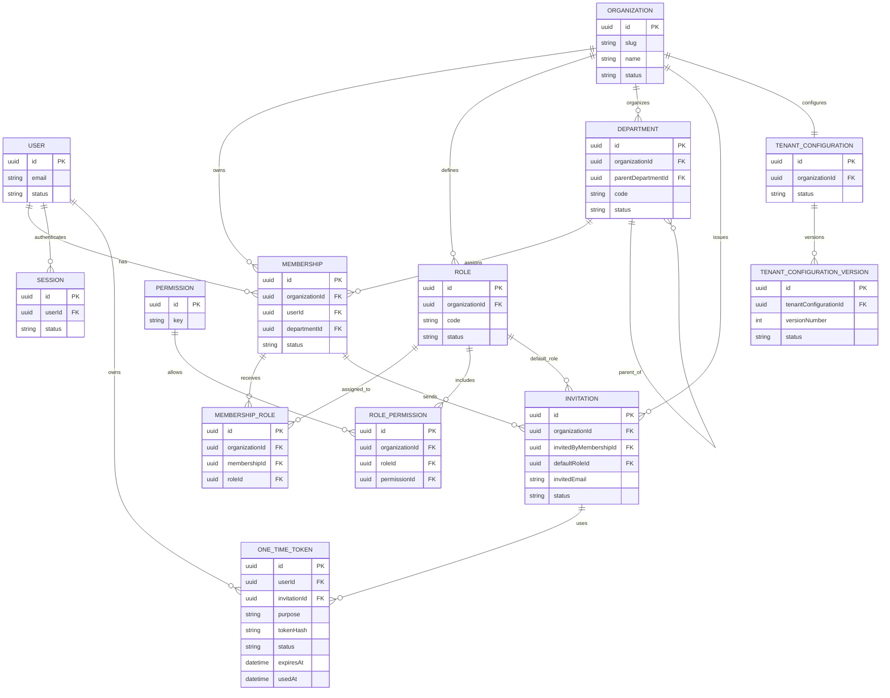
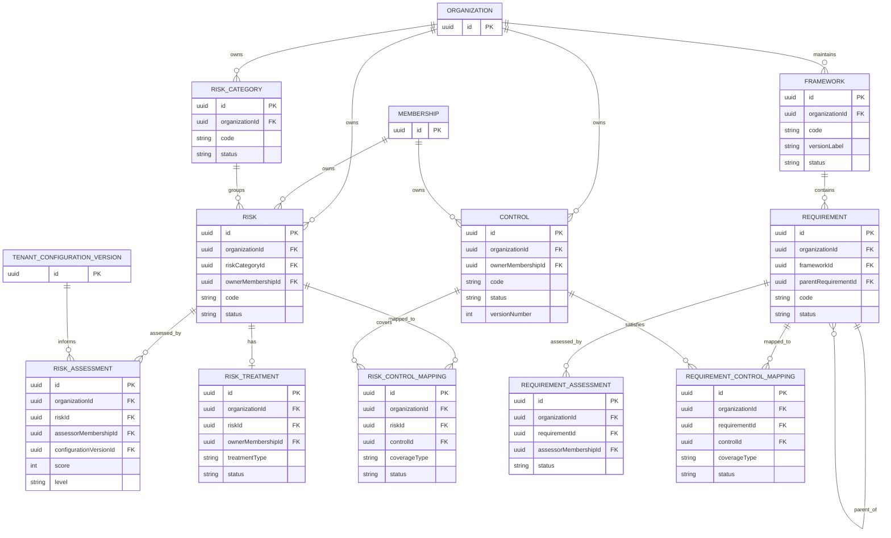
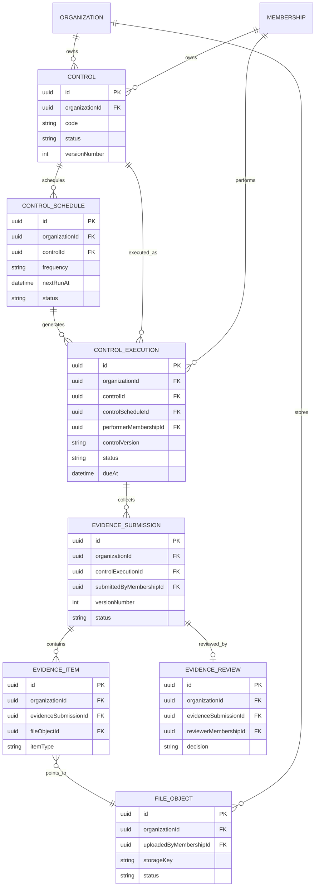
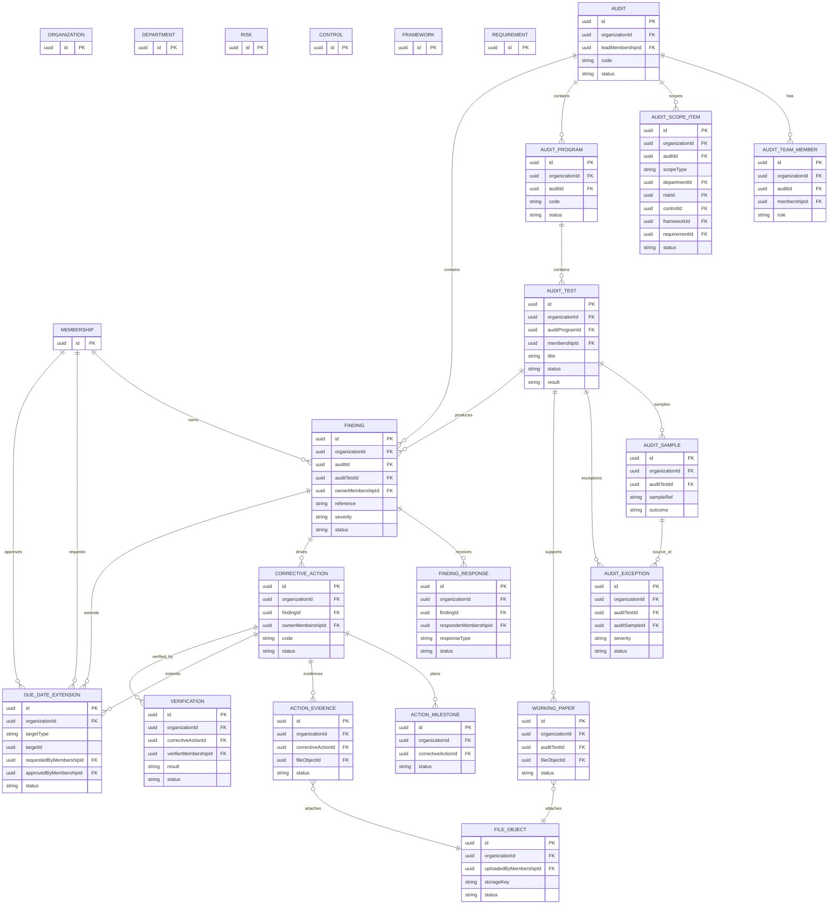
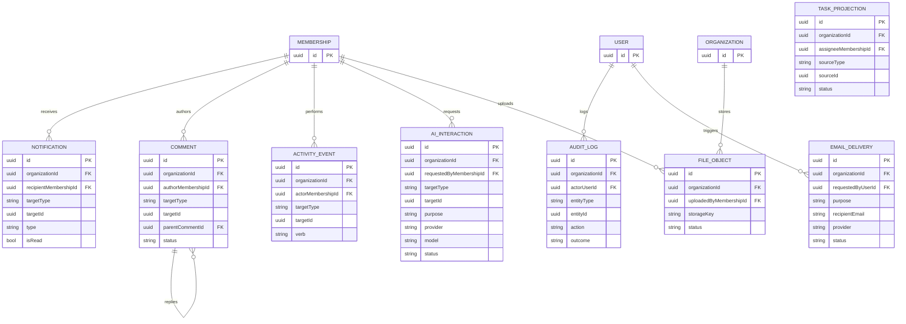

# RiskSphere Phase 0 Proposed Logical ERD

Status: proposed architectural baseline
Date: August 8, 2026

## 1. Purpose

This document proposes the Phase 0 logical data model for RiskSphere.

It is **not** the final Prisma schema and it is **not** a migration plan. It is the architectural map we should use to reason about relationships, tenant boundaries, historical state, and cross-cutting support records before implementation starts.

The guiding rule is:

> Design globally, implement incrementally.

That means we are mapping the full relational shape now, while still expecting Prisma models and migrations to evolve as each product phase is implemented.

### Modeling conventions

- `User` is global.
- `Organization` is the tenant root.
- `Membership` is the tenant-scoped bridge between `User` and `Organization`.
- A membership may hold multiple roles through `MembershipRole`; effective permissions are the union of all attached roles.
- Tenant-owned records normally carry `organizationId`.
- Tenant-owned assignment fields should point to `Membership`, not global `User`.
- Human-readable business references such as risk codes, control codes, audit references, and finding references are tenant-scoped and unique within an organization.
- `TenantConfiguration` is the current tenant settings root, while `TenantConfigurationVersion` preserves immutable snapshots.
- Cross-cutting support tables may use generic references when hard foreign keys would create too many narrow tables.
- Historical records are append-only or effectively append-only after a workflow decision.
- Authoritative domain records are the source of truth; projections and logs are not.

## 2. Domain Groups

### 2.1 Identity / Tenancy / RBAC

This group defines who a user is, which organizations they can access, how role membership works, and how tenant-scoped permissions are applied. It also includes the invitation and session support records needed for onboarding and authentication.

### 2.2 Risk Management

This group models the risk register, point-in-time assessments, treatment planning, and explicit risk-to-control mapping.

### 2.3 Compliance

This group models frameworks, hierarchical requirements, compliance assessments, and requirement-to-control mappings.

### 2.4 Controls and Mappings

This group models reusable controls, the control schedule that generates work, and the many-to-many coverage relationships between controls, risks, and requirements.

### 2.5 Control Operations and Evidence

This group models recurring control executions, evidence submission/versioning, reviewer decisions, and file metadata.

### 2.6 Audit Management

This group models audits, audit teams, scope selection, programs, tests, samples, exceptions, and working papers.

### 2.7 Findings and Remediation

This group models findings, responses, corrective actions, milestones, remediation evidence, due-date changes, and independent verification.

### 2.8 Cross-Cutting Services

These are support records that cut across multiple domains: notifications, comments, activity history, audit logs, AI usage metadata, email delivery, file metadata, and computed work-queue views.

## 3. Complete Mermaid ERD

```mermaid
erDiagram
  USER {
    uuid id PK
    string email
    string status
    datetime createdAt
  }

  ORGANIZATION {
    uuid id PK
    string slug
    string name
    string status
    datetime createdAt
  }

  MEMBERSHIP {
    uuid id PK
    uuid organizationId FK
    uuid userId FK
    uuid departmentId FK
    string status
    datetime createdAt
  }

  ROLE {
    uuid id PK
    uuid organizationId FK
    string code
    string name
    string status
  }

  PERMISSION {
    uuid id PK
    string key
    string name
  }

  MEMBERSHIP_ROLE {
    uuid id PK
    uuid organizationId FK
    uuid membershipId FK
    uuid roleId FK
  }

  ROLE_PERMISSION {
    uuid id PK
    uuid organizationId FK
    uuid roleId FK
    uuid permissionId FK
  }

  DEPARTMENT {
    uuid id PK
    uuid organizationId FK
    uuid parentDepartmentId FK
    string code
    string name
    string status
  }

  INVITATION {
    uuid id PK
    uuid organizationId FK
    uuid invitedByMembershipId FK
    uuid defaultRoleId FK
    string invitedEmail
    string status
    datetime expiresAt
  }

  SESSION {
    uuid id PK
    uuid userId FK
    string status
    datetime expiresAt
  }

  ONE_TIME_TOKEN {
    uuid id PK
    uuid userId FK
    uuid invitationId FK
    string purpose
    string tokenHash
    string status
    datetime expiresAt
    datetime usedAt
  }

  TENANT_CONFIGURATION {
    uuid id PK
    uuid organizationId FK
    string status
    datetime updatedAt
  }

  TENANT_CONFIGURATION_VERSION {
    uuid id PK
    uuid tenantConfigurationId FK
    int versionNumber
    string status
    datetime effectiveAt
  }

  RISK_CATEGORY {
    uuid id PK
    uuid organizationId FK
    string code
    string name
    string status
  }

  RISK {
    uuid id PK
    uuid organizationId FK
    uuid riskCategoryId FK
    uuid ownerMembershipId FK
    string code
    string title
    string status
    int currentScore
    string currentLevel
  }

  RISK_ASSESSMENT {
    uuid id PK
    uuid organizationId FK
    uuid riskId FK
    uuid assessorMembershipId FK
    uuid configurationVersionId FK
    int score
    string level
    datetime assessedAt
  }

  RISK_TREATMENT {
    uuid id PK
    uuid organizationId FK
    uuid riskId FK
    uuid ownerMembershipId FK
    string treatmentType
    string status
    datetime reviewAt
  }

  RISK_CONTROL_MAPPING {
    uuid id PK
    uuid organizationId FK
    uuid riskId FK
    uuid controlId FK
    string coverageType
    string status
  }

  FRAMEWORK {
    uuid id PK
    uuid organizationId FK
    string code
    string name
    string versionLabel
    string status
  }

  REQUIREMENT {
    uuid id PK
    uuid organizationId FK
    uuid frameworkId FK
    uuid parentRequirementId FK
    string code
    string status
  }

  REQUIREMENT_ASSESSMENT {
    uuid id PK
    uuid organizationId FK
    uuid requirementId FK
    uuid assessorMembershipId FK
    string status
    datetime assessedAt
  }

  REQUIREMENT_CONTROL_MAPPING {
    uuid id PK
    uuid organizationId FK
    uuid requirementId FK
    uuid controlId FK
    string coverageType
    string status
  }

  CONTROL {
    uuid id PK
    uuid organizationId FK
    uuid ownerMembershipId FK
    string code
    string name
    string status
    int versionNumber
  }

  CONTROL_SCHEDULE {
    uuid id PK
    uuid organizationId FK
    uuid controlId FK
    string frequency
    datetime nextRunAt
    string status
  }

  CONTROL_EXECUTION {
    uuid id PK
    uuid organizationId FK
    uuid controlId FK
    uuid controlScheduleId FK
    uuid performerMembershipId FK
    string controlVersion
    datetime periodStart
    datetime periodEnd
    string status
    datetime dueAt
  }

  EVIDENCE_SUBMISSION {
    uuid id PK
    uuid organizationId FK
    uuid controlExecutionId FK
    uuid submittedByMembershipId FK
    int versionNumber
    string status
    datetime submittedAt
  }

  EVIDENCE_ITEM {
    uuid id PK
    uuid organizationId FK
    uuid evidenceSubmissionId FK
    uuid fileObjectId FK
    string itemType
  }

  EVIDENCE_REVIEW {
    uuid id PK
    uuid organizationId FK
    uuid evidenceSubmissionId FK
    uuid reviewerMembershipId FK
    string decision
    datetime reviewedAt
  }

  FILE_OBJECT {
    uuid id PK
    uuid organizationId FK
    uuid uploadedByMembershipId FK
    string storageKey
    string mimeType
    bigint sizeBytes
    string status
  }

  AUDIT {
    uuid id PK
    uuid organizationId FK
    uuid leadMembershipId FK
    string code
    string title
    string status
  }

  AUDIT_TEAM_MEMBER {
    uuid id PK
    uuid organizationId FK
    uuid auditId FK
    uuid membershipId FK
    string role
  }

  AUDIT_SCOPE_ITEM {
    uuid id PK
    uuid organizationId FK
    uuid auditId FK
    string scopeType
    uuid departmentId FK
    uuid riskId FK
    uuid controlId FK
    uuid frameworkId FK
    uuid requirementId FK
    string status
  }

  AUDIT_PROGRAM {
    uuid id PK
    uuid organizationId FK
    uuid auditId FK
    string code
    string title
    string status
  }

  AUDIT_TEST {
    uuid id PK
    uuid organizationId FK
    uuid auditProgramId FK
    uuid membershipId FK
    string title
    string status
    string result
  }

  AUDIT_SAMPLE {
    uuid id PK
    uuid organizationId FK
    uuid auditTestId FK
    string sampleRef
    string outcome
  }

  AUDIT_EXCEPTION {
    uuid id PK
    uuid organizationId FK
    uuid auditTestId FK
    uuid auditSampleId FK
    string severity
    string status
  }

  WORKING_PAPER {
    uuid id PK
    uuid organizationId FK
    uuid auditTestId FK
    uuid fileObjectId FK
    string title
    string status
  }

  FINDING {
    uuid id PK
    uuid organizationId FK
    uuid auditId FK
    uuid auditTestId FK
    uuid ownerMembershipId FK
    string reference
    string severity
    string status
    datetime dueAt
  }

  FINDING_RESPONSE {
    uuid id PK
    uuid organizationId FK
    uuid findingId FK
    uuid responderMembershipId FK
    string responseType
    string status
    datetime respondedAt
  }

  CORRECTIVE_ACTION {
    uuid id PK
    uuid organizationId FK
    uuid findingId FK
    uuid ownerMembershipId FK
    string code
    string status
    datetime dueAt
  }

  ACTION_MILESTONE {
    uuid id PK
    uuid organizationId FK
    uuid correctiveActionId FK
    string title
    datetime dueAt
    string status
  }

  ACTION_EVIDENCE {
    uuid id PK
    uuid organizationId FK
    uuid correctiveActionId FK
    uuid fileObjectId FK
    string status
  }

  DUE_DATE_EXTENSION {
    uuid id PK
    uuid organizationId FK
    uuid findingId FK
    uuid correctiveActionId FK
    uuid requestedByMembershipId FK
    uuid approvedByMembershipId FK
    datetime newDueAt
    string status
  }

  VERIFICATION {
    uuid id PK
    uuid organizationId FK
    uuid correctiveActionId FK
    uuid verifierMembershipId FK
    string result
    datetime verifiedAt
    string status
  }

  NOTIFICATION {
    uuid id PK
    uuid organizationId FK
    uuid recipientMembershipId FK
    string targetType
    uuid targetId
    string type
    bool isRead
    datetime createdAt
  }

  COMMENT {
    uuid id PK
    uuid organizationId FK
    uuid authorMembershipId FK
    string targetType
    uuid targetId
    uuid parentCommentId FK
    string status
    datetime createdAt
  }

  ACTIVITY_EVENT {
    uuid id PK
    uuid organizationId FK
    uuid actorMembershipId FK
    string targetType
    uuid targetId
    string verb
    datetime createdAt
  }

  AUDIT_LOG {
    uuid id PK
    uuid organizationId FK
    uuid actorUserId FK
    string entityType
    uuid entityId
    string action
    string outcome
    datetime createdAt
  }

  AI_INTERACTION {
    uuid id PK
    uuid organizationId FK
    uuid requestedByMembershipId FK
    string targetType
    uuid targetId
    string purpose
    string provider
    string model
    string status
    datetime createdAt
  }

  EMAIL_DELIVERY {
    uuid id PK
    uuid organizationId FK
    uuid requestedByUserId FK
    string purpose
    string recipientEmail
    string provider
    string status
    datetime createdAt
  }

  USER ||--o{ MEMBERSHIP : has
  ORGANIZATION ||--o{ MEMBERSHIP : owns
  DEPARTMENT ||--o{ MEMBERSHIP : assigns
  ORGANIZATION ||--o{ ROLE : defines
  ORGANIZATION ||--o{ DEPARTMENT : organizes
  DEPARTMENT ||--o{ DEPARTMENT : parent_of
  ROLE ||--o{ MEMBERSHIP_ROLE : assigned_to
  MEMBERSHIP ||--o{ MEMBERSHIP_ROLE : receives
  ROLE ||--o{ ROLE_PERMISSION : includes
  PERMISSION ||--o{ ROLE_PERMISSION : allows
  ORGANIZATION ||--o{ INVITATION : issues
  MEMBERSHIP ||--o{ INVITATION : sends
  ROLE ||--o{ INVITATION : default_role
  USER ||--o{ SESSION : authenticates
  USER ||--o{ ONE_TIME_TOKEN : owns
  INVITATION ||--o{ ONE_TIME_TOKEN : uses
  ORGANIZATION ||--|| TENANT_CONFIGURATION : configures
  TENANT_CONFIGURATION ||--o{ TENANT_CONFIGURATION_VERSION : versions

  ORGANIZATION ||--o{ RISK_CATEGORY : classifies
  ORGANIZATION ||--o{ RISK : owns
  MEMBERSHIP ||--o{ RISK : owns
  RISK_CATEGORY ||--o{ RISK : groups
  RISK ||--o{ RISK_ASSESSMENT : assessed_by
  MEMBERSHIP ||--o{ RISK_ASSESSMENT : performs
  TENANT_CONFIGURATION_VERSION ||--o{ RISK_ASSESSMENT : informs
  RISK ||--o| RISK_TREATMENT : has
  MEMBERSHIP ||--o{ RISK_TREATMENT : owns
  RISK ||--o{ RISK_CONTROL_MAPPING : mapped_to
  CONTROL ||--o{ RISK_CONTROL_MAPPING : covers

  ORGANIZATION ||--o{ FRAMEWORK : maintains
  FRAMEWORK ||--o{ REQUIREMENT : contains
  REQUIREMENT ||--o{ REQUIREMENT : parent_of
  REQUIREMENT ||--o{ REQUIREMENT_ASSESSMENT : assessed_by
  MEMBERSHIP ||--o{ REQUIREMENT_ASSESSMENT : performs
  REQUIREMENT ||--o{ REQUIREMENT_CONTROL_MAPPING : mapped_to
  CONTROL ||--o{ REQUIREMENT_CONTROL_MAPPING : satisfies

  ORGANIZATION ||--o{ CONTROL : owns
  MEMBERSHIP ||--o{ CONTROL : owns
  CONTROL ||--o{ CONTROL_SCHEDULE : schedules
  CONTROL_SCHEDULE ||--o{ CONTROL_EXECUTION : generates
  CONTROL ||--o{ CONTROL_EXECUTION : executed_as
  MEMBERSHIP ||--o{ CONTROL_EXECUTION : performs
  CONTROL_EXECUTION ||--o{ EVIDENCE_SUBMISSION : collects
  MEMBERSHIP ||--o{ EVIDENCE_SUBMISSION : submits
  EVIDENCE_SUBMISSION ||--o{ EVIDENCE_ITEM : contains
  EVIDENCE_ITEM }o--|| FILE_OBJECT : points_to
  EVIDENCE_SUBMISSION ||--o| EVIDENCE_REVIEW : reviewed_by
  MEMBERSHIP ||--o{ EVIDENCE_REVIEW : reviews
  ORGANIZATION ||--o{ FILE_OBJECT : stores
  MEMBERSHIP ||--o{ FILE_OBJECT : uploads

  ORGANIZATION ||--o{ AUDIT : plans
  MEMBERSHIP ||--o{ AUDIT : leads
  AUDIT ||--o{ AUDIT_TEAM_MEMBER : has
  MEMBERSHIP ||--o{ AUDIT_TEAM_MEMBER : joins
  AUDIT ||--o{ AUDIT_SCOPE_ITEM : scopes
  DEPARTMENT ||--o{ AUDIT_SCOPE_ITEM : included_in
  RISK ||--o{ AUDIT_SCOPE_ITEM : included_in
  CONTROL ||--o{ AUDIT_SCOPE_ITEM : included_in
  FRAMEWORK ||--o{ AUDIT_SCOPE_ITEM : included_in
  REQUIREMENT ||--o{ AUDIT_SCOPE_ITEM : included_in
  AUDIT ||--o{ AUDIT_PROGRAM : contains
  AUDIT_PROGRAM ||--o{ AUDIT_TEST : contains
  MEMBERSHIP ||--o{ AUDIT_TEST : executes
  AUDIT_TEST ||--o{ AUDIT_SAMPLE : samples
  AUDIT_TEST ||--o{ AUDIT_EXCEPTION : exceptions
  AUDIT_SAMPLE ||--o{ AUDIT_EXCEPTION : source_of
  AUDIT_TEST ||--o{ WORKING_PAPER : supports
  WORKING_PAPER }o--|| FILE_OBJECT : attaches
  AUDIT_TEST ||--o{ FINDING : produces

  AUDIT ||--o{ FINDING : contains
  MEMBERSHIP ||--o{ FINDING : owns
  FINDING ||--o{ FINDING_RESPONSE : receives
  MEMBERSHIP ||--o{ FINDING_RESPONSE : responds
  FINDING ||--o{ CORRECTIVE_ACTION : drives
  MEMBERSHIP ||--o{ CORRECTIVE_ACTION : owns
  CORRECTIVE_ACTION ||--o{ ACTION_MILESTONE : plans
  CORRECTIVE_ACTION ||--o{ ACTION_EVIDENCE : evidences
  ACTION_EVIDENCE }o--|| FILE_OBJECT : attaches
  FINDING ||--o{ DUE_DATE_EXTENSION : extends
  CORRECTIVE_ACTION ||--o{ DUE_DATE_EXTENSION : extends
  MEMBERSHIP ||--o{ DUE_DATE_EXTENSION : requests
  MEMBERSHIP ||--o{ DUE_DATE_EXTENSION : approves
  CORRECTIVE_ACTION ||--o{ VERIFICATION : verified_by
  MEMBERSHIP ||--o{ VERIFICATION : verifies

  MEMBERSHIP ||--o{ NOTIFICATION : receives
  MEMBERSHIP ||--o{ COMMENT : authors
  COMMENT ||--o{ COMMENT : replies
  MEMBERSHIP ||--o{ ACTIVITY_EVENT : performs
  USER ||--o{ AUDIT_LOG : logs
  MEMBERSHIP ||--o{ AI_INTERACTION : requests
  USER ||--o{ EMAIL_DELIVERY : triggers
```

## 4. ERD by Domain

### 4A. Identity / Tenancy / RBAC

### 4B. Risk + Compliance + Controls

### 4C. Control Execution + Evidence

### 4D. Audit + Findings + Remediation

### 4E. Cross-Cutting Entities

## 5. Entity Responsibility Table

### 5.1 Identity / Tenancy / RBAC

| Entity | Scope | Purpose | Primary Parent | Historical / Mutable | Phase Introduced |
|---|---|---|---|---|---|
| User | Global | Global account and authentication identity | None | Mutable | 1 |
| Organization | Tenant | Root tenant record | None | Mutable, archived rather than deleted | 1 |
| Membership | Tenant | Bridge between user and organization | User + Organization | Mutable | 1 |
| Role | Tenant | Named permission bundle within an organization | Organization | Mutable | 1 |
| Permission | Global | Atomic authorization capability catalog | None | Mostly static | 1 |
| MembershipRole | Tenant | Assign one or more roles to a membership | Membership + Role | Mutable | 1 |
| RolePermission | Tenant | Assign permissions to a role | Role + Permission | Mutable | 1 |
| Department | Tenant | Organizational unit with optional hierarchy | Organization, self-parent | Mutable | 1 |
| Invitation | Tenant | Invite a user into an organization | Organization, invited by Membership | Historical | 1 |
| Session | Global | Refresh-token session lifecycle | User | Historical / revocable | 1 |
| OneTimeToken | Supporting | Unified invitation, email verification, and password reset token store | User or Invitation | Historical / immutable after use | 1 |
| TenantConfiguration | Tenant | Current tenant settings | Organization | Mutable | 1 |
| TenantConfigurationVersion | Tenant | Immutable configuration snapshot | TenantConfiguration | Historical / append-only | 2 |

### 5.2 Risk Management

| Entity | Scope | Purpose | Primary Parent | Historical / Mutable | Phase Introduced |
|---|---|---|---|---|---|
| RiskCategory | Tenant | Tenant-specific risk classification | Organization | Mutable | 2 |
| Risk | Tenant | Risk register record | Organization + RiskCategory + Membership | Mutable with history events | 2 |
| RiskAssessment | Tenant | Point-in-time assessment snapshot | Risk | Historical / append-only | 2 |
| RiskTreatment | Tenant | Current treatment plan and ownership | Risk | Mutable | 2 |
| RiskControlMapping | Tenant | Explicit coverage relation between risks and controls | Risk + Control | Mutable with history events | 2 |

### 5.3 Compliance

| Entity | Scope | Purpose | Primary Parent | Historical / Mutable | Phase Introduced |
|---|---|---|---|---|---|
| Framework | Tenant | Compliance standard container | Organization | Mutable, archived rather than deleted | 3 |
| Requirement | Tenant | Hierarchical compliance requirement | Framework, self-parent | Mutable, archived rather than deleted | 3 |
| RequirementAssessment | Tenant | Point-in-time compliance snapshot | Requirement | Historical / append-only | 3 |
| RequirementControlMapping | Tenant | Explicit coverage relation between requirements and controls | Requirement + Control | Mutable with history events | 3 |
| Control | Tenant | Reusable control definition | Organization + Membership | Mutable, archived rather than deleted | 3 |

### 5.4 Control Operations and Evidence

| Entity | Scope | Purpose | Primary Parent | Historical / Mutable | Phase Introduced |
|---|---|---|---|---|---|
| ControlSchedule | Tenant | Recurring schedule that generates executions | Control | Mutable | 4 |
| ControlExecution | Tenant | One occurrence of control work | ControlSchedule + Control + Membership | Historical state with controlled reopen | 4 |
| EvidenceSubmission | Tenant | Versioned evidence package for one execution | ControlExecution | Historical / versioned | 4 |
| EvidenceItem | Tenant | File, URL, or text evidence item | EvidenceSubmission | Historical within submission version | 4 |
| EvidenceReview | Tenant | Immutable review decision for one submission version | EvidenceSubmission | Historical / immutable decision | 4 |
| FileObject | Tenant | File metadata only; binary stored externally | Organization + Membership | Historical metadata | 4 |

### 5.5 Audit Management

| Entity | Scope | Purpose | Primary Parent | Historical / Mutable | Phase Introduced |
|---|---|---|---|---|---|
| Audit | Tenant | Audit container and lifecycle | Organization | Mutable, archived rather than deleted | 5 |
| AuditTeamMember | Tenant | Audit team membership and role | Audit + Membership | Mutable | 5 |
| AuditScopeItem | Tenant | Explicit scope selection for an audit | Audit and scoped entity | Mutable with history events | 5 |
| AuditProgram | Tenant | Audit-specific procedure container | Audit | Mutable | 5 |
| AuditTest | Tenant | Audit-specific test instance | AuditProgram | Mutable until completed, then controlled reopen | 5 |
| AuditSample | Tenant | Sample record for a test | AuditTest | Historical | 5 |
| AuditException | Tenant | Exception or issue discovered during testing | AuditTest | Historical | 5 |
| WorkingPaper | Tenant | Audit test supporting document metadata | AuditTest + FileObject | Historical metadata | 5 |

### 5.6 Findings and Remediation

| Entity | Scope | Purpose | Primary Parent | Historical / Mutable | Phase Introduced |
|---|---|---|---|---|---|
| Finding | Tenant | Formal audit finding record | Audit + AuditTest + Membership | Mutable with controlled workflow transitions | 6 |
| FindingResponse | Tenant | Management response, rebuttal, or risk acceptance record | Finding | Historical / append-only | 6 |
| CorrectiveAction | Tenant | Remediation work item for a finding | Finding | Mutable with workflow history | 6 |
| ActionMilestone | Tenant | Milestone inside a corrective action plan | CorrectiveAction | Historical / append-only | 6 |
| ActionEvidence | Tenant | Evidence supporting a corrective action | CorrectiveAction + FileObject | Historical metadata | 6 |
| DueDateExtension | Tenant | Immutable record of deadline change | Finding or CorrectiveAction | Historical / append-only | 6 |
| Verification | Tenant | Independent verification decision | CorrectiveAction | Historical / immutable decision | 6 |

### 5.7 Cross-Cutting Services

| Entity | Scope | Purpose | Primary Parent | Historical / Mutable | Phase Introduced |
|---|---|---|---|---|---|
| Notification | Supporting | In-app notification feed | Derived from many source records | Supporting projection | 4 |
| Comment | Supporting | Contextual discussion on records | Polymorphic target | Historical / append-only after edit window | 7 |
| ActivityEvent | Supporting | User-facing record timeline | Polymorphic target | Append-only | 7 |
| AuditLog | Supporting | Technical/security audit trail | Polymorphic target | Append-only | 7 |
| AiInteraction | Supporting | AI usage metadata and safeguards | Optional polymorphic source record | Historical / append-only | 8 |
| EmailDelivery | Supporting | Email attempt and provider delivery status | User or invitation context | Historical / append-only | 1 |

## 6. Relationship Analysis

### 6.1 Identity and tenancy

- `User` and `Organization` are not directly many-to-many. `Membership` is the bridge.
- `Membership` may also carry an optional department assignment so the active tenant context can default to a business unit when needed.
- A user can belong to multiple organizations.
- A membership is the unit that carries tenant context, role assignment, and most tenant-scoped ownership references.
- `MembershipRole` makes the many-to-many relationship between memberships and roles explicit.
- Effective permissions are the union of the permissions granted by all roles attached to a membership.
- `RolePermission` makes the many-to-many relationship between roles and permissions explicit.
- `Department` is tenant-owned and self-referential for hierarchy.
- `Invitation` belongs to an organization and can pre-stage a default role for onboarding.

### 6.2 Risk, compliance, and controls

- `Risk` is the business record; `RiskAssessment` is the point-in-time score snapshot.
- `Risk` ownership is membership-based so stewardship stays tenant-scoped.
- `RiskTreatment` is the current treatment plan; it should not overwrite the assessment history.
- `Framework` is the compliance container; `Requirement` is the hierarchical child record.
- `RequirementAssessment` preserves compliance state over time.
- `Control` is reusable and independent of any one risk or requirement.
- `Control` ownership is membership-based so control stewardship does not rely on global users.
- `RiskControlMapping` and `RequirementControlMapping` are explicit domain entities because they carry coverage, justification, and status.

### 6.3 Control operations and evidence

- `ControlSchedule` turns a reusable control into recurring work.
- `ControlExecution` is one occurrence of that work, not the control definition itself.
- `ControlExecution` is assigned to a membership so recurring work can be owned and performed in tenant context.
- `EvidenceSubmission` is versioned because resubmissions must preserve history.
- `EvidenceReview` is immutable per submission version.
- `EvidenceItem` is where the file, URL, or text payload for a submission version lives.
- `FileObject` is only file metadata; binary storage lives outside PostgreSQL.

### 6.4 Audit and findings

- `Audit` is the audit container.
- `AuditProgram` structures the audit work inside the audit.
- `AuditTest` is the executable test instance.
- `AuditSample`, `AuditException`, and `WorkingPaper` hang off the test.
- `Finding` can be sourced from the audit or a specific test.
- `Finding` ownership is membership-based, independent from the audit lead or the corrective-action owner.
- `AuditScopeItem` is deliberately one typed table with exactly one target FK populated so audit scoping stays relationally safe.
- `CorrectiveAction` is a separate workflow from the finding itself.
- `DueDateExtension` uses typed nullable foreign keys to `Finding` or `CorrectiveAction` so deadline history stays explicit without unrestricted polymorphism.
- `Verification` is a separate immutable decision entity, not a boolean flag on `Finding` or `CorrectiveAction`.

### 6.5 Cross-cutting service records

- "My Tasks" should start as a computed backend query over authoritative records, not a persisted projection table.
- `Notification` is a persisted side effect for polling, not the source of truth.
- `Comment`, `ActivityEvent`, `AuditLog`, `AiInteraction`, and `EmailDelivery` are support records and not authoritative business entities.

## 7. Tenant Boundary Analysis

### Tables that should normally contain `organizationId`

- `Organization` is the tenant root, so it obviously carries its own identity.
- `Membership`
- `Role`
- `MembershipRole`
- `RolePermission`
- `Department`
- `Invitation`
- `TenantConfiguration`
- `TenantConfigurationVersion`
- `RiskCategory`
- `Risk`
- `RiskAssessment`
- `RiskTreatment`
- `RiskControlMapping`
- `Framework`
- `Requirement`
- `RequirementAssessment`
- `RequirementControlMapping`
- `Control`
- `ControlSchedule`
- `ControlExecution`
- `EvidenceSubmission`
- `EvidenceItem`
- `EvidenceReview`
- `FileObject`
- `Audit`
- `AuditTeamMember`
- `AuditScopeItem`
- `AuditProgram`
- `AuditTest`
- `AuditSample`
- `AuditException`
- `WorkingPaper`
- `Finding`
- `FindingResponse`
- `CorrectiveAction`
- `ActionMilestone`
- `ActionEvidence`
- `DueDateExtension`
- `Verification`
- `Notification`
- `Comment`
- `ActivityEvent`
- `AiInteraction`
- `EmailDelivery`

### Truly global tables

- `User`
- `Permission`
- `Session`

### Supporting tables that may be hybrid

- `OneTimeToken` can be attached to a user, invitation, or both, depending on purpose.
- `AuditLog` can be tenant-scoped or platform-scoped.
- `EmailDelivery` may be tenant-scoped for invitations and password resets, but it is still a support record rather than a business record.

### Same-tenant integrity strategy

- Every tenant-owned relation should be checked by both foreign key and `organizationId`.
- Every join table that crosses tenant-owned records should include `organizationId` or be validated against both parent records.
- Tenant-owned assignments should reference `Membership`, not global `User`.
- Any mapping between `Risk` and `Control`, or `Requirement` and `Control`, must reject cross-tenant joins.
- Any audit scope row must only reference resources from the same organization as the audit.
- Any execution, evidence, finding, action, or verification must remain inside one tenant boundary.
- Prisma relations should be paired with database constraints or composite uniqueness where practical so a sensitive mapping cannot point across tenants just because a raw resource id exists.

### Application-level validation still required

Even with PostgreSQL foreign keys, the application must still enforce:

- active membership context
- permission checks
- workflow transition rules
- self-verification prohibition
- duplicate business code prevention
- idempotent scheduler generation
- polymorphic target allowlists for support tables

## 8. History / Versioning Strategy

### Entities that should preserve historical state

- `RiskAssessment`
- `RequirementAssessment`
- `EvidenceSubmission`
- `EvidenceReview`
- `FindingResponse`
- `ActionMilestone`
- `ActionEvidence`
- `DueDateExtension`
- `Verification`
- `TenantConfigurationVersion`
- `AuditLog`
- `ActivityEvent`

### Why they are historical

- They record decisions or point-in-time states that must not be silently overwritten.
- They preserve auditability and explainability.
- They support re-review, resubmission, and closure checks.

### Entities that should stay current / mutable

- `Risk`
- `RiskTreatment`
- `Framework`
- `Requirement`
- `Control`
- `ControlSchedule`
- `Audit`
- `AuditProgram`
- `AuditTest` while in progress
- `Finding`
- `CorrectiveAction`

These records can change, but the changes should be captured through workflow events or activity history rather than destructive replacement.

### Versioning recommendation

For Phase 0, the minimum stable versioned records are the ones whose history is explicitly required by the PRD. `TenantConfigurationVersion` is part of that baseline. If later implementation shows that framework or control content needs immutable revision chains, we can add dedicated version tables without changing the overall domain boundaries.

## 9. Polymorphic Design Decisions

| Entity | Alternatives | Recommendation | Advantages | Disadvantages |
|---|---|---|---|---|
| Comment | Separate comment tables per domain vs one generic comment table | One generic `Comment` table with `targetType` + `targetId` | Avoids many small tables, easy for UI, good for collaboration | No direct FK to the target record |
| Notification | Separate tables per source vs one generic notification table | One generic `Notification` table with `recipientMembershipId` and generic target reference | Simple polling model, supports all domains | Requires application validation for target references |
| ActivityEvent | Per-domain timeline tables vs one generic event stream | One append-only `ActivityEvent` table | Consistent user-facing history, easy timeline rendering | Weaker FK guarantees to the target |
| AuditLog | One table per entity vs a generic append-only log | One generic `AuditLog` table | Good for security and platform auditability, low schema overhead | Not a replacement for domain history |
| AuditScopeItem | Generic `entityType/entityId` vs explicit mapping tables | One explicit `AuditScopeItem` table with `scopeType` and nullable typed FKs | Preserves referential integrity and Prisma ergonomics | Wider table, more validation rules |
| DueDateExtension | Separate tables per target vs one typed history table | One `DueDateExtension` table with nullable typed FKs to `Finding` and `CorrectiveAction` | Keeps deadline history explicit while preserving referential integrity | Wider table, requires exactly-one-target validation |

### Recommendation summary

- Use generic support tables for comments, notifications, activity, audit logs, and AI metadata.
- Use typed nullable foreign keys for due-date extensions.
- Use explicit typed foreign keys for audit scope.
- Do not use generic polymorphism for core authoritative domain relations such as risk-to-control or requirement-to-control mapping.

## 10. Constraint and Index Recommendations

### Primary key convention

- Use UUID primary keys for all proposed entities.

### Composite uniqueness recommendations

- `Organization.slug` should be unique globally.
- `Membership` should be unique per `(organizationId, userId)` unless the PRD later requires multiple memberships for the same user in the same organization.
- `Role.code` should be unique per organization.
- `Department.code` should be unique per organization.
- `RiskCategory.code` should be unique per organization.
- `Risk.code` should be unique per organization.
- `Framework.code` should be unique per organization.
- `Requirement.code` should be unique within a framework or framework version, depending on the final revision strategy.
- `Control.code` should be unique per organization.
- `Finding.reference` should be unique per organization.
- `TenantConfigurationVersion` should be unique per `(tenantConfigurationId, versionNumber)`.
- `EvidenceSubmission` should be unique per `(organizationId, controlExecutionId, versionNumber)`.
- `OneTimeToken.tokenHash` should be unique, and raw token values should never be stored.
- Tenant-scoped business references such as risk codes, control codes, audit codes, and finding references should be unique within an organization.
- `MembershipRole` should not allow the same membership-role pair twice.
- `RolePermission` should not allow the same role-permission pair twice.
- `RiskControlMapping` and `RequirementControlMapping` should not allow duplicate active mappings for the same pair.
- `AuditScopeItem` should have a check constraint that allows exactly one target FK to be populated and that the populated FK matches `scopeType`.
- `DueDateExtension` should have a check constraint that allows exactly one target FK to be populated across `findingId` and `correctiveActionId`.

### Indexing recommendations

- Start most tenant-owned list indexes with `organizationId`.
- Likely high-value composite indexes:
  - `(organizationId, status, updatedAt)`
  - `(organizationId, ownerMembershipId, status)`
  - `(organizationId, dueAt, status)`
  - `(organizationId, isRead, createdAt)`
  - `(organizationId, code)`
- Search and filter fields should be indexed where the PRD expects list and dashboard performance.
- Tenant-owned assignment fields such as `ownerMembershipId`, `performerMembershipId`, `reviewerMembershipId`, `verifierMembershipId`, and `uploadedByMembershipId` should be indexed with `organizationId` where they drive tenant-scoped queues or lookups.

### Soft delete / archive rules

Prefer `archive`, `retire`, `deactivate`, or `suspend` over hard delete for:

- Organization
- Membership
- Role
- Department
- Risk
- Framework
- Requirement
- Control
- ControlSchedule
- ControlExecution
- EvidenceSubmission
- EvidenceReview
- Audit
- AuditProgram
- AuditTest
- Finding
- CorrectiveAction
- FindingResponse
- ActionMilestone
- ActionEvidence
- DueDateExtension
- Verification

Hard delete should be reserved for accidental pre-use records or data that must be purged for compliance reasons.

## 11. Phase Mapping

### Phase 1 - Identity and Tenancy

- User
- Organization
- Membership
- Role
- Permission
- MembershipRole
- RolePermission
- Department
- Invitation
- Session
- OneTimeToken
- TenantConfiguration
- EmailDelivery

### Phase 2 - Risk Management

- TenantConfigurationVersion
- RiskCategory
- Risk
- RiskAssessment
- RiskTreatment
- RiskControlMapping

### Phase 3 - Compliance and Controls

- Framework
- Requirement
- RequirementAssessment
- RequirementControlMapping
- Control

### Phase 4 - Control Operations, Evidence, Notifications

- ControlSchedule
- ControlExecution
- EvidenceSubmission
- EvidenceItem
- EvidenceReview
- FileObject
- Notification
- My Tasks computed query over authoritative records (not persisted)

### Phase 5 - Audit Management

- Audit
- AuditTeamMember
- AuditScopeItem
- AuditProgram
- AuditTest
- AuditSample
- AuditException
- WorkingPaper

### Phase 6 - Findings and Remediation

- Finding
- FindingResponse
- CorrectiveAction
- ActionMilestone
- ActionEvidence
- DueDateExtension
- Verification

### Phase 7 - Reporting, Governance, Search, Collaboration

- Comment
- ActivityEvent
- AuditLog

### Phase 8 - AI Assistance and Hardening

- AiInteraction

## 12. Open Design Questions

1. Should `Control` and `Framework` gain explicit version tables now, or should versioning stay implicit until phase 3 proves it necessary?
2. Should business references such as risk codes, control codes, findings, and audit references use tenant-scoped sequences, manual entry, or a hybrid numbering service?
3. Should `Comment` support threaded replies beyond a simple parent pointer, or stay flat until collaboration needs prove otherwise?
4. Should `AuditLog` stay in a single tenant-aware table with optional platform-scoped rows, or split into separate operational and security logs later?

## 13. Proposed Decisions

### Safe to lock in during Phase 0

- `User` is global.
- `Organization` is the tenant root.
- `Membership` bridges `User` and `Organization`.
- Tenant-owned records carry `organizationId`.
- `MembershipRole` is an explicit join entity and memberships can hold multiple roles.
- `RolePermission` is an explicit join entity.
- `RiskControlMapping` and `RequirementControlMapping` are explicit domain entities.
- `ControlExecution` is not the same thing as `Control`.
- `EvidenceSubmission` must be versioned.
- `EvidenceReview` must be immutable per submission version.
- `Verification` must be its own immutable decision entity.
- `AuditScopeItem` should be an explicit typed table with exactly one populated target FK.
- `DueDateExtension` should use typed nullable target FKs rather than generic polymorphism.
- `FileObject` should store metadata only, not binary content, and should be tenant-owned.
- `OneTimeToken` should unify invitation, reset, and verification token handling.
- Business codes should be tenant-scoped and unique within their tenant.

### Provisional, but still good architectural bets

- `TenantConfigurationVersion` should exist.
- `EmailDelivery` should track provider attempts and remain separate from domain workflows.
- `AuditLog` and `ActivityEvent` should be separate records, because they serve different audiences.
- `Notification` should remain a persisted support record for polling-based delivery.
- `Comment`, `ActivityEvent`, `AuditLog`, and `AiInteraction` can use selective polymorphic targeting for support records.

### Defer until the relevant implementation phase

- Whether `Control` and `Framework` need explicit version tables.
- Whether `Requirement` needs a separate revision chain or a simpler archive model.
- Whether business reference sequencing needs a dedicated generator service.
- Whether `Comment` needs threaded replies beyond a simple parent pointer.
- Whether `AuditLog` needs a separate platform-level stream in addition to tenant-scoped records.

## 14. Risk Review

These are the places where a poor schema choice now could make later migrations painful:

- **Tenant isolation** - the most expensive failure would be any cross-tenant mapping that is not checked by both FK and `organizationId`.
- **RBAC** - if memberships and roles are not explicit, later permission changes become brittle.
- **Historical assessments** - overwriting assessments would destroy the core audit trail.
- **Recurring control work** - if executions are not separated from controls, schedule history becomes impossible to trust.
- **Evidence versioning** - resubmissions must be preserved or evidence review loses credibility.
- **Audit hierarchy** - audit tests, samples, exceptions, and findings need a clean parent chain.
- **Independent verification** - self-verification must be structurally hard to do by mistake.
- **Activity and audit logs** - if they are merged with business data, they stop being trustworthy records.
- **Business identifiers** - codes that are not tenant-scoped will collide across organizations.
- **Polymorphic support tables** - support tables are fine with generic references, but only if the application validates allowed targets and keeps authoritative workflow relations typed.

## 15. Final Phase-0 Recommendation

### A. Structure we should commit to now

- User is global.
- Membership is the bridge between User and Organization.
- Organization is the tenant root.
- Tenant-owned records carry `organizationId`.
- Roles and permissions are explicit, with join tables for membership-role and role-permission.
- Memberships can hold multiple roles and effective permissions are the union of those roles.
- RiskAssessment preserves point-in-time scoring history.
- RequirementAssessment preserves point-in-time compliance history.
- Control is reusable and separate from ControlExecution.
- EvidenceSubmission is versioned.
- EvidenceReview is immutable per submission version.
- Finding leads to CorrectiveAction, which leads to Verification.
- Independent verification is its own entity.
- TenantConfigurationVersion preserves tenant configuration history.
- FileObject is tenant-owned metadata with uploadedByMembershipId.
- OneTimeToken unifies invitation, verification, and reset flows.
- DueDateExtension uses typed nullable foreign keys to `Finding` and `CorrectiveAction`.
- Mapping tables between risks, requirements, and controls are first-class domain records.
- File metadata belongs in `FileObject`, not in PostgreSQL blobs.

### B. Structure we should provisionally model

- EmailDelivery as a first-class support record.
- Notification as a persisted support record.
- Comment, ActivityEvent, AuditLog, and AiInteraction as selectively polymorphic support tables.
- AuditScopeItem as one typed table with nullable target FKs.

### C. Structure we should deliberately defer

- Explicit version tables for Control and Framework unless phase 3 implementation proves they are necessary.
- Persisted task projections; My Tasks should start as a computed query.
- Separate scope tables per audit target type.
- Threaded comment complexity beyond a parent pointer.
- Any reporting table that duplicates authoritative domain data.
